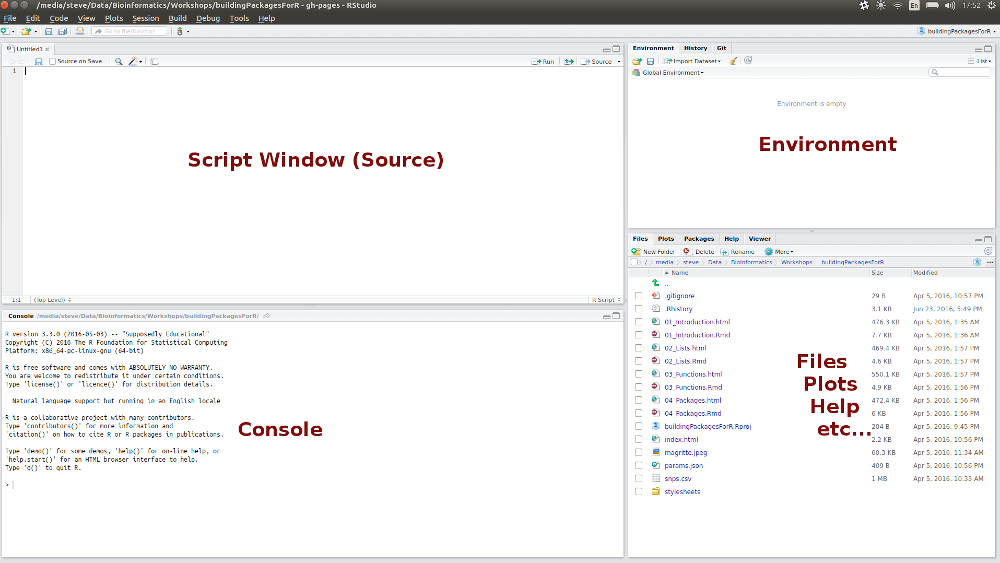

```{r setup, include=FALSE}
knitr::opts_chunk$set(echo = FALSE, include = FALSE, 
                      warning = FALSE, message = FALSE, 
                      out.width = 800, fig.align = "center")
```

```{r, loadPackages}
library(knitr)
```

## Who Am I? | Steve Pederson

- R User for >10 years
- Co-ordinator, Bioinformatics Hub  
    - Level 4, Santos Petroleum Engineering Building

Also helping today:

- Alastair Ludington (Bioinformatics Hub)

## Today's Outline | Four 90 minute Sessions

1. Introduction
```{r}
    # - The basics and creating R objects
    # - Using RStudio
    # - Keeping track of our analysis
```
2. Loading Data Into R
```{r}
    # - Installing Packages
    # - How similar to Excel is R
    # - Manipulating Data Frames
```
3. What have we really done?
```{r}
    # - Data Structures in R
    # - Subsetting R Objects
```
4. The Genomics Era
```{r}
    # - The Bioconductor Project
    # - Accessing Annotations
    # - Genomic Ranges
```

# Introduction

## Why use R?

- Began as a statistical tool in the 1990s (Ross Ihaka & Robert Gentleman)
- Evolved far beyond it's original design
- Current estimates are ~2 million users

```{r}
knitr::opts_chunk$set(echo = TRUE, include = TRUE, results = 'markup')
```

## Why use R?

- The main software/language used for analysis and visualisation of biological data (along with Python)
- Can handle extremely large datasets  
- We can easily perform complex analytic procedures
- Many processes come as inbuilt functions  
- Huge user base of biological researchers

## Why use R? | Other Key Reasons

- Avoids common Excel pitfalls
- Reproducible Research

## Automatic Conversion | A common Excel problem

**Excel is notorious for converting values from one thing to another inappropriately.**

- Gene names are often converted to dates (e.g. _SEPT9_)

- Genotypes can be converted into numeric values (e.g. the homozygote "1/1")
    
- In `R` we generally work with plain text files.
    
## Reproducible Research

- Research is littered with mistakes from Excel
- Studies have made Phase III trials
- _We have code to record and exactly repeat our analysis_
- We can find and correct errors more easily than if they are copy/paste errors

## Using R

>__With power comes great responsibility - Uncle Ben__
  
With the extra capability R offers, we need to understand a little about:

1. Data Types  
2. Data Structures  

We'll get to that later...

_First, we'll just explore the `R` Console_


## What is R? 

- Can be treated as a simple calculator:

```{r, echo=TRUE, include=TRUE, results='markup'}
1 + 2
```


## What is R? 

- Contains all standard mathematical functions `+`, `-`, `*`, `/`, `^`

```{r, echo=TRUE, include=TRUE, results='markup'}
2^3
1 + 2 - 3 * 4 / 5
```

## What is R? 

- Built-in functions for common transformations like `log` or $\sqrt{~}$ 
- Place the values inside the round braces after the function name

```{r, echo=TRUE, include=TRUE, results='markup'}
sqrt(2)
log(10)
```

## What is R? 

- Trigonometric Functions `sin()`, `cos()`, `tan()`
- Other common functions like `abs()` for the absolute value

```{r, echo=TRUE, include=TRUE, results='markup'}
abs(-1)
```

## What is R? 

- Two common log transforms are also included

```{r, echo=TRUE, include=TRUE, results='markup'}
log2(0.5)
log10(0.001)
```

## What is R? 

- There is no `inverse()` function. 

### How would we find the inverse of a number?

# Creating Objects In R

## Creating Objects in R

- In `R` we can save objects and give them a name
- We type the desired name, folowed by `<-`, then the value

```{r}
x <- 5
```

### 2 Key points!!!
1. The value was not "_printed_" to the screen
2. The _assignment operator_ (`<-`) acts like an arrow **placing the value** in the object `x`

## Creating Objects in R

Yes we could have written:

```{r}
x = 5
```

- The standard convention is to use `<-` 
- This is specific to creation of a new `R` object.
- It makes it clear **to all readers** that you are placing a value into an object

### What other use might the `=` sign have?

## Creating Objects in R

We could also have written

```{r}
5 -> x
```

But no-one ever does...

## Using R objects

- To see the value(s) that `x` contains, we just type it's name:

```{r}
x
```

- We occasionally like to be _very specific_ and use the `print()` command

```{r}
print(x)
```

## Using R objects

- We can pass this value to any function, or do math on it

```{r, results='hide'}
sqrt(x)
x^2
x + 1
```

# Using R Studio

## Using R Studio

- RStudio is the most common way of interacting with `R`
- We can save all of our commands in a single file
- We can view a summary of our objects, make plots, import & export data etc.

## Using R Studio | R Projects

- R Projects are not compulsory, but are VERY useful!
- Just a simple wrapper to help keep an analysis/workshop organised
- When we open an R Project, we go back to the last state (i.e. where we were last time)
- Also great for interacting with version control (e.g. git)

## Using R Studio | R Projects

Let's set one up for this course: `File > New Project`

```{r, echo = FALSE, include=TRUE, out.width=540}
include_graphics("images/Project.png")
```

## Using R Studio | R Projects

- Choose either a `New` or `Existing` Directory
- Navigate to somewhere you think is suitable for keeping the course notes
- The project name will _automatically be assigned_ as the directory name
- (These need to match)

## Using R Studio

1. `File` > `New File` > `R Script`  
2. Save As `Introduction.R`

## Using R Studio

- Note that the directory of the project was the automatic directory opened to save the file
- This is your working directory


```{r, echo=FALSE}
knitr::opts_chunk$set(echo = TRUE, include = TRUE, results = 'hide')
```

```{r}
getwd()
```

## Using RStudio

```{r, echo=FALSE,include=TRUE, results='asis'}

```

## The Script Window

- This is just a simple text editor.
- We enter our commands here but they are not executed
    - We can keep a record of __everything__ we've done
    - We can also add comments to our code
    - Comments start with the `#` symbol
    - RStudio will automatically colour our code for easy reading

## Using RStudio

```{r, echo=FALSE,include=TRUE, results='asis'}

```

## The Console

- Where we execute commands
- Is essentially the _"engine"_
- We can execute commands directly in the `Console` or send from the `Script Window`

## Executing Code from the Script Window

Enter the following in the `Script Window`

```{r, echo=TRUE, include=TRUE}
# Create our first R object
x <- 5
```

- We have not sent this to R yet!
    - Only the plain text exists in the Script Window

## Executing Code from the Script Window

- Lines of code are sent to the `Console` by either:
    - `Ctrl + Enter`
    - Copy & Paste into the Console
    - Clicking the `Run` button at the top right

- Try this with your code

## Executing Commands from the Script Window

We can view the contents of the object `x` by:

- entering it's name directly in the `Console`, or 
- entering it's name in the `Script Window` & sending it to the `Console`

```{r, echo=TRUE, include=TRUE, results='hide'}
x
print(x)
```

## The R Environment

__Where have we created the object `x`?__

- Is it on your hard drive somewhere?
- Is it in a file somewhere?

## The R Environment

- We have placed `x` in our `R Workspace`
- More formally known as your `Global Environment`

```{r, echo=FALSE, include=TRUE, results='asis', out.width=600}
include_graphics("images/EnvironmentTab.png")
```

## The R Environment

- The `Environment` is like your desktop
- We keep all our relevant objects here and can save all the objects in your workspace as an `.RData` object

```{r, eval=FALSE, echo=TRUE, include=TRUE}
save.image()
```

- Just like in Excel, we save a *workbook* with *multiple sheets*
- Here we save a *workspace* with *multiple objects*
- _And we can save the code use to create these objects!_

## RStudio | Other Tabs and Features

- Next to the `Environment` Tab is the `History` Tab
    - Contains everything executed in the `Console`
    - Useful for when we've been lazy
- Best coding practice is still to enter code in the `Script Window` and execute

## RStudio | Other Tabs and Features

In the bottom right are a series of tabs

1. `Files`: This shows your current working directory
2. `Plots`: Every time you make a graph it appears here
3. `Packages`: __NEVER CLICK OR UN-CLICK ANYTHING HERE__
4. `Help`: We'll explore this later

## RStudio | Other Tabs and Features

- Every tab can be resized using the buttons in the top right
- Window separators can also be be moved

## RStudio | Cheatsheet and Shortcuts

`Help > Cheatsheets > RStudio IDE Cheat Sheet`

Page 2 has lots of hints:

- `Ctrl + 1` places focus on the Script Window
- `Ctrl + 2` places focus on the Console
- `Ctrl + 3` places focus on the Help Tab

## Morning Tea

### Next:

Session 2 - Loading data into R

<div class="footer" style="text-align:center;width:25%">
[Home](https://uofabioinformaticshub.github.io/Intro_R_Genomics_Dec_2016/)
</div>
