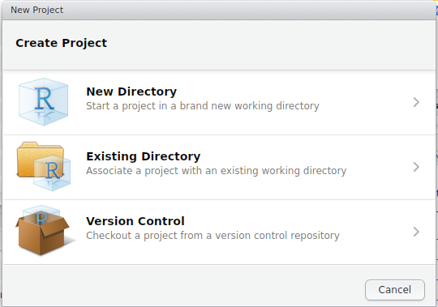

```{r setup, include=FALSE}
knitr::opts_chunk$set(echo = FALSE, include = FALSE, 
                      warning = FALSE, message = FALSE, 
                      out.width = 800, fig.align = "center")
```

```{r, loadPackages}
library(knitr)
```


# Using R Studio

## Using R Studio

- RStudio is the most common way of interacting with `R`
- We can save all of our commands in a single file (__Reproducible Research__)
- We can view a summary of our objects, make plots, import & export data etc.

## Using R Studio | R Projects

- R Projects are not compulsory, but are VERY useful!
- Just a simple wrapper to help keep an analysis/workshop organised
- When we open an R Project, we go back to the last state (i.e. where we were last time)
- Also great for interacting with version control (e.g. git)

## Using R Studio | R Projects

Let's set one up for this course: `File > New Project`

```{r, echo = FALSE, include=TRUE, out.width=540}

```

## Using R Studio | R Projects

- Choose either a `New` or `Existing` Directory
- Navigate to somewhere you think is suitable for keeping the course notes
- The project name will _automatically be assigned_ as the directory name
- (These need to match)

## Using R Studio

1. `File` > `New File` > `R Script`  
2. Save As `Introduction.R`

## Using R Studio

- Note that the directory of the project was the automatic directory opened to save the file
- This is your working directory


```{r, echo=FALSE}
knitr::opts_chunk$set(echo = TRUE, include = TRUE, results = 'hide')
```

```{r}
getwd()
```

## Using RStudio

```{r, echo=FALSE,include=TRUE, results='asis'}
include_graphics("images/RStudio.png")
```

## The Script Window

- This is just a simple text editor.
- We enter our commands here but they are not executed
    - We can keep a record of __everything__ we've done
    - We can also add comments to our code
    - Comments start with the `#` symbol
    - RStudio will automatically colour our code for easy reading

## Using RStudio

```{r, echo=FALSE,include=TRUE, results='asis'}
include_graphics("images/RStudio.png")
```

## The Console

- Where we execute commands
- Is essentially the _"engine"_
- We can execute commands directly in the `Console` or send from the `Script Window`

## Executing Code from the Script Window

Enter the following in the `Script Window`

```{r, echo=TRUE, include=TRUE}
# Create an example R object
x <- 5
```

- We have not sent this to R yet!
    - Only the plain text exists in the Script Window

## Executing Code from the Script Window

- Lines of code are sent to the `Console` by either:
    - `Ctrl + Enter`
    - Copy & Paste into the Console
    - Clicking the `Run` button at the top right

- Try this with your code

## Executing Commands from the Script Window

We can view the contents of the object `x` by:

- entering it's name directly in the `Console`, or 
- entering it's name in the `Script Window` & sending it to the `Console`

```{r, echo=TRUE, include=TRUE, results='hide'}
x
print(x)
```

## The R Environment

__Where have we created the object `x`?__

- Is it on your hard drive somewhere?
- Is it in a file somewhere?

## The R Environment

- We have placed `x` in our `R Workspace`
- More formally known as your `Global Environment`

```{r, echo=FALSE, include=TRUE, results='asis', out.width=600}
include_graphics("images/EnvironmentTab.png")
```

## The R Environment

- The `Environment` is like your desktop
- We keep all our relevant objects here and can save all the objects in your workspace as an `.RData` object

```{r, eval=FALSE, echo=TRUE, include=TRUE}
save.image()
```

- Just like in Excel, we save a *workbook* with *multiple sheets*
- Here we save a *workspace* with *multiple objects*
- _And we can save the code use to create these objects!_

## RStudio | Other Tabs and Features

- Next to the `Environment` Tab is the `History` Tab
    - Contains everything executed in the `Console`
    - Useful for when we've been lazy
- Best coding practice is still to enter code in the `Script Window` and execute

## RStudio | Other Tabs and Features

In the bottom right are a series of tabs

1. `Files`: This shows your current working directory
2. `Plots`: Every time you make a graph it appears here
3. `Packages`: __NEVER CLICK OR UN-CLICK ANYTHING HERE__
4. `Help`: We'll explore this later

## RStudio | Other Tabs and Features

- Every tab can be resized using the buttons in the top right
- Window separators can also be be moved

## RStudio | Cheatsheet and Shortcuts

`Help > Cheatsheets > RStudio IDE Cheat Sheet`

Page 2 has lots of hints:

- `Ctrl + 1` places focus on the Script Window
- `Ctrl + 2` places focus on the Console
- `Ctrl + 3` places focus on the Help Tab


## Morning Tea

### Next:

Session 2 - Loading data into R

<div class="footer" style="text-align:center;width:25%">
[Home](https://uofabioinformaticshub.github.io/Intro_R_Genomics_Dec_2016/)
</div>
