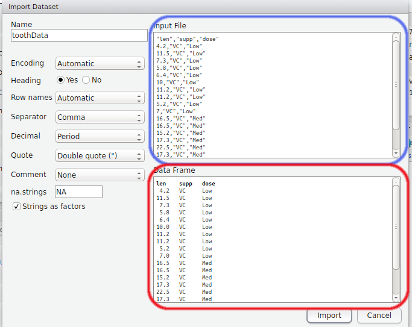
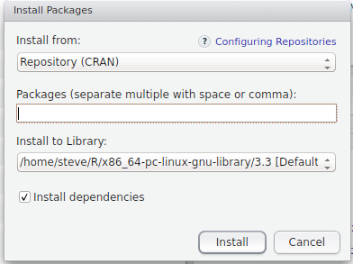

```{r setup, include=FALSE}
library(knitr)
opts_chunk$set(echo = TRUE, include = TRUE, 
               warning = FALSE, message = FALSE, 
               out.width = 800, fig.align = "center")
```

## Importing Data

- A stumbling block for many learning `R` is the __Error Messages__
- We often see them while we're loading data
- `R` is very strict about data formats
- We can load `.xlsx`, `xls`, `csv`, `txt`, `gtf/gff` files + many more
- The structure of the spreadsheet is vital

## Importing Data

- Things we do to make it "look nice" in Excel can create problems
- In `data`, open `RealTimeData.xlsx` in Excel (or Libre Office)

__Which sheet do you think will be the most problematic to load?__

<div class="footer" style="font-size:55%;width:50%;line-spacing:1;text-align:right">
  <p>Worksheet downloaded from Gaurav Nagar, Indian Veterinary Research Institute</p>
</div>

## Importing Data

### Sheet 1

- This is actually the type of format `R` loves to see
    - Simple column structure, with column and row names
    - No blank rows at the top or separating sub-tables
    - No blank columns
    - No merged cells

## Importing Data

### Sheet 2
__What about all those missing values?__

## Importing Data

### Sheet 2
__What about all those missing values?__

- `R` can happily deal with missing values: $\implies$ will load as `NA`
- The missing column names may give strange behaviours
- Otherwise no problems

## Importing Data

### Sheet 3

- Here we effectively have 2 tables on the same sheet
    - Will this cause error messages?
    - `R` guesses the number of columns from the first row
    - The plot will simply be ignored

__Always think in terms of columns__

## Using the GUI To Load Data

- In today's `data` folder is the file `toothData.csv`
- Clicking on it will open it in the `Script Window` as a text file
- We can use the button as shown


## Using the GUI To Load Data | The Preview Window


```{r, echo=FALSE, out.width=550}

```

## Using the GUI To Load Data

1. Try changing a few settings & note changes in the Preview
2. Once you're happy, click "Import"

You will see two lines of code in the `Console` $\implies$ two things have just happened

```{r, eval=FALSE}
toothData <- read.csv("data/toothData.csv")
View(toothData)
```

## Using the GUI To Load Data

```{r}
toothData <- read.csv("data/toothData.csv")
```

__ALWAYS__ copy the first line into your script!

- This is the exact command we've used to load the file
- Anything we've set by clicking will also be in this line

## Using the GUI To Load Data

```{r, eval=FALSE}
View(toothData)
```

The second line has opened a preview of our `R` object

- By default, the `R` object will be named using the file-name before the `.csv`
- Also look at the `toothData` object in the `Environment` tab (click the arrow)

## Data Frame Objects

- The object `toothData` is known as a `data.frame`
- `R` equivalent to a spreadsheet
- Three possible ways to inspect this are:

```{r,eval=FALSE}
View(toothData)
toothData
head(toothData)
```

__What were the differences between each method?__

## Data Frame Objects

- In a `data.frame` each column is a vector:
    - Each column has a single type of data
    - Different columns can be different types of data
    
## Data Frame Objects | Factors

- By default `R` assumes that a column of text is a categorical variable (i.e. a `factor`)
- We can change this by un-checking the `stringsAsFactors` button during import

## Data Frame Objects | Subsetting

- We can use the square braces to select rows and columns `[row, column]`

```{r, results='hide'}
toothData[1:2,] # Select the first 2 rows, all columns
toothData[1:5, 1] # The first 5 entries in the first column
```

## Data Frame Objects | Subsetting

Because each column is a vector, we can use an alternative method (`$`)

```{r, results='hide'}
toothData$len #Print the entire column vector called 'len'
toothData$len[1:5] # Now just the first 5 entries
```

## Data Frame Objects | Subsetting

Calling by name:

```{r, results='hide'}
toothData[1:5, "len"]
toothData$len[1:5] 
```

### When would you use either method?

## Data Frame Objects | Subsetting

One easy trap to fall into - forgetting the comma

```{r, results='hide'}
toothData["len"]
toothData[["len"]]
```


# R Functions and Packages

## What have we really done?

- In the above section we called the `R` function `read.csv()` 
- This is in the `utils` package which is one of the default packages
- A package is just a collection of related functions, e.g. 
    - `median()` & `sd()` are in the `stats` package
    - `max()`, `sum()`, `+` are in the `base` package

## A Better Alternative

- The package `readr` has a similar, but slightly superior version called `read_csv()`
- No GUI for this method

### How do we install packages?

- There is a central repository known as `CRAN`

## Installing Packages

`Tools > Install Packages ...`

```{r, echo=FALSE, out.width=450}

```

## Installing Packages

- Enter the package name `readr` then `Install`

- It should auto-complete once you start typing

- Now try the following packages: `readxl`, `dplyr`, `ggplot2`, `reshape2`, `stringr`

(This may take a few minutes - use the coloured post-it notes)

## Loading Packages

```{r}
library(dplyr)
library(readr)
```

You might see lots of friendly messages...

```{r}
toothData <- read_csv("data/toothData.csv")
```

## A Better Alternative | Why is this better?

1. Much faster
2. Character columns are left as plain text
3. It also runs some checks on your data $\implies$ can give more error messages
4. Output is a `local data frame` (i.e. a `tibble`)  
    $\implies$ display in the `Console` is more convenient

```{r, eval=FALSE}
toothData
```

## Reading Help Pages

```{r, eval=FALSE}
?read_csv
```

- Once again we have four functions but stick to `read_csv()`
- This function has numerous arguments given as names <br>(e.g. `file`, `col_names`)
    - If just the name is given, we need to specify something
    - Otherwise the argument is given a default value <br>(e.g. `col_names = TRUE`) 
    - If specifying in order, we don't need to name arguments

## Reading Help Pages

```{r, eval=FALSE}
toothData <- read_csv("data/toothData.csv")
```

Is equivalent to:

```{r, eval=FALSE}
toothData <- read_csv(file = "data/toothData.csv")
```

## Reading Help Pages

__If we had a file with 3 blank lines to start, is there an argument that can help?__


## Reading Help Pages

__If we had a file with 3 blank lines to start, is there an argument that can help?__

```{r, eval=FALSE}
read_csv("path/to/file.csv", skip = 3)
```


## Reading Help Pages | Bonus Slide

- The bottom three functions are simplified wrappers to `read_delim()`
- `read_csv()` calls `read_delim()` using `delim = ","`
- `read_csv2()` calls `read_delim()` using `delim = ";"`
- `read_tsv()` calls `read_delim()` using `delim = "\t"`

__What function would we call for *space-delimited* files?__

## Loading Excel Files

`R` also has a package for loading `.xls` and `xlsx` files.

```{r}
library(readxl)
```

The main function is `read_excel()`

```{r, eval=FALSE}
?read_excel
```

# Dealing With Difficult Data

## Data Cleaning | What if the data we have isn't nice?

- Missing values might be given a value (e.g. 9999, "NA")
- Column names might be missing
- File may have comments
- May be structural errors in the file
- White-space in cells
- Merged Cells (these are difficult...)

## Dealing With Column Names

- `read_csv()` has an argument called `col_names`
- NB:`read.csv()` refers to column names as a `header`
- By default, the first row is assumed to contain the names of the variables/columns, i.e. `col_names = TRUE`
- This tells `R` how many columns you have

__What happens if we get this wrong?__

```{r}
no_header <- read_csv("data/no_header.csv")
```

## Dealing With Column Names

We can easily fix this

```{r}
no_header <- read_csv("data/no_header.csv", col_names = FALSE)
```

__What about that first column?__

## Dealing With Column Names

We can specify what is loaded or skipped using `col_types`

```{r, eval=FALSE}
?read_csv
```

- We can skip columns using the `-` symbol
- `character` and `numbers` use `c` and `n` respectively

```{r}
no_header <- read_csv("data/no_header.csv", col_names = FALSE,
                      col_types = "-ccnnc")
```

__What if we get that wrong?__

## Dealing With Column Names | Getting it wrong

Let's mis-specify the third column as a number

```{r}
no_header <- read_csv("data/no_header.csv", col_names = FALSE,
                      col_types = "-cnnnc")
```

- Did the error message make any sense?
- Did the file load?
- What happened to the third column?

## Dealing With Comments

Let's get it wrong first

```{r}
comments <- read_csv("data/comments.csv")
```

Now we can get it right

```{r}
comments <- read_csv("data/comments.csv", comment = "#")
```

This will work if there are comments in __any__ rows

## Structural Problems

**What happens when you try to load the file `bad_colnames_.csv`**

```{r}
bad_colnames <- read_csv("data/bad_colnames.csv")
```

__How could we fix this?__

a. By editing the file, and 
b. Without editing the file

## Structural Problems

__Here's my fix__

```{r}
bad_colnames <- read_csv("data/bad_colnames.csv", 
                             skip =  1, col_names = FALSE)
colnames(bad_colnames) <- c("rowname", "gender", "name",
                                "weight", "height", "transport")
```

- Here we have set the column names manually using a character vector
- Note that all words were quoted.

## Removing Column Names

The most common function in `R` is `c()`

- This stands for `combine`
- Combines all values into a single `R` object, or `vector`
- If left empty, it is equivalent to `NULL`

```{r, results='markup'}
c()
colnames(bad_colnames) <- c()
```

## Encoded Missing Values

__What if missing values have been set to "-"?__

Let's get it wrong first

```{r}
missing_data <- read_csv("data/missing_data.csv")
```

__Where have the errors appeared?__

Now we can get it right

```{r}
missing_data <- read_csv("data/missing_data.csv", na = "-")
```

## Exporting Data

After we've edited a file, we might wish to export it

```{r}
?write_csv
```

- This is a wrapper for `write_delim()`
- Can export `.csv`, `.txt`, `.tsv` etc
- Individual `R` objects can be exported using `write_rds()`

---

<div class="footer" style="text-align:center;width:25%">
[Home](https://uofabioinformaticshub.github.io/Intro_R_Genomics_Dec_2016/)
</div>